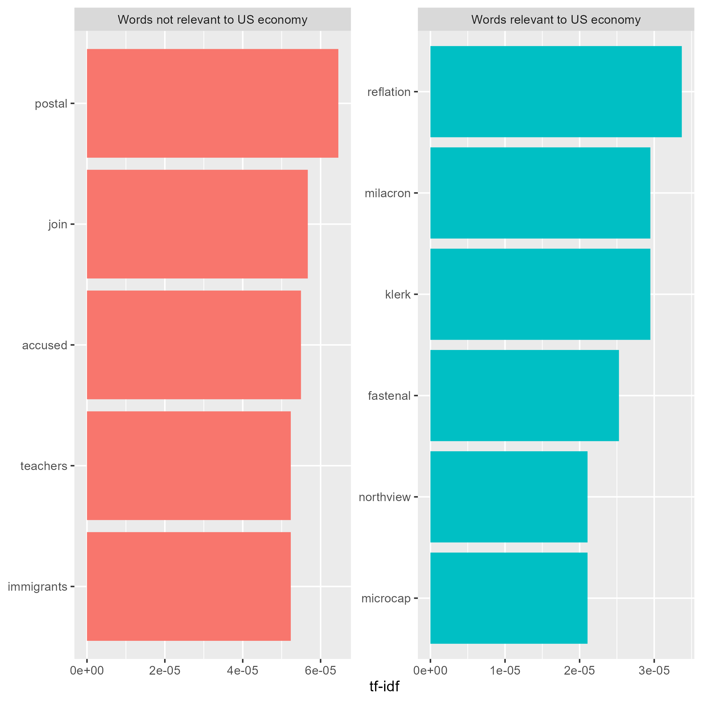
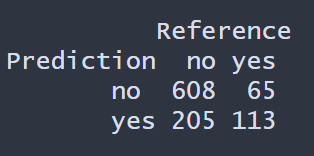

# natural-language-processing

This project, Naive Bayes is used to classified 8,000 news articles into two categories, whether or not the articles are relevant to US Economy (`relevance`).

The data can be found [here](https://www.kaggle.com/datasets/heeraldedhia/us-economic-news-articles).

# Explanatory plots

The figure below show the most important word by relevance to US economy using the `tf-idf` statistic. The plot on the the left shows the top 5 five words that are not related to US economy articles such as "postal", "accused", and "teacher". Compare to the top 5 words that are relevant such as "reflation", "milacron", and "microcap".

Data was formatted to tidy text and clean by removing stop words, punctuation, removing white space,  transforming text to all lowercase and then converting to Document Term Matrix.  

Data was randomly split by 60,000 to training and 10,000 for testing. The table below shows the proportion of response in the training and test set which is balanced.  

The Naive Bayes model results on the testing set is shown below. The prevalence is 0.1796, meaning about 18% of the articles are realted to US economy.  The balanced accuracy of the model is 0.7275 with a 95% CI between 0.6987 and 0.7551,  precision is 0.3553, recall 0.6348, and F1  0.4556. 

The Naive Bayes model seems to do relative well with 95% CI between 0.6987 and 0.7551. However the no information rate of the data 0.8204. Thus, Naive Bayes does not to great at predicting articles that are relevant to US economy. 

